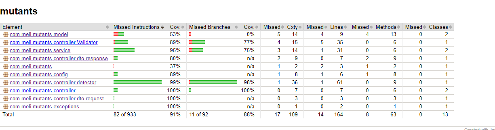

# Prueba Mercado Libre

## Descripción
El reto consiste en crear unA API la cual debe poder detectar si el adn de una persona es Mutante.
Para esto se debe validar  el input que corresponde a una matriz de NxN  y si se encuentra dos o mas secuencias de ADN mayores al valor dado ( 4 en este caso )  se cataloga como mutante.
Tambien se debe poder consultar la cantidad de humanos y mutantes q se han enviado y el ratio entre estos.

La descripcion completa completa se encuentr acá :

[Descrición de la prueba](src/main/resources/Examen%20Mercadolibre%20%20-%20Mutantes.pdf)

## Implementación

La solucion se desarrollo  utilizando :
- Java 8.
- Maven 3.6.2.
- MySql ( AWS RDS).
- H2 para los test.
- Junit.
- JaCoCo.
- Desplegado en una instancia EC2 de AWS


## Ejecución

Para iniciar lso servicio se debe ejecutar :
```
java -jar mutants.jar
```
Los servicios estan expuestos a través de AWS bajo los siguientes url :

- Servicio de identificación de mutante  :

Se debe realizar una petición POST a la siguiente url:
http://ec2-3-91-20-241.compute-1.amazonaws.com:8081/mutant

Se debe enviar en el body la cadena de adn a verificar, por ejemplo :
```
 {"dna":["AAATGT",
         "CAGCCC",
         "TTTTGT",
         "AGAAGG",
         "CCCCTA",
         "TCACTG"]}
```
El servivio retornará un estado 200 o 403 según el caso

- Servicio de stats :

Se de realizar una petición GET a la url :
https://ec2-3-91-20-241.compute-1.amazonaws.com:8081/stats

El servicio retornará un objeto json de la siguiente estructura :
```
{
    "count_mutant_dna": 1,
    "count_human_dna": 1,
    "ratio": 1
}
```
## Coverage

Para realizar el coverage se utilizó JaCoCo , obteniendo un porcentage del 91%

<p align="center"> 
  
</p>

